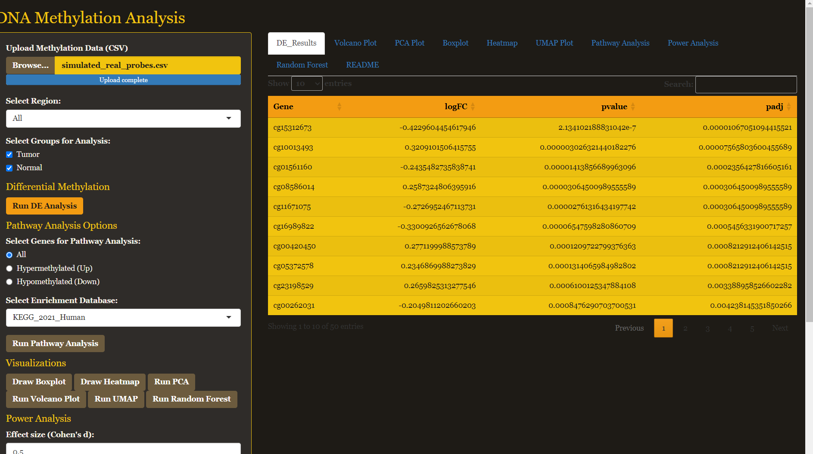
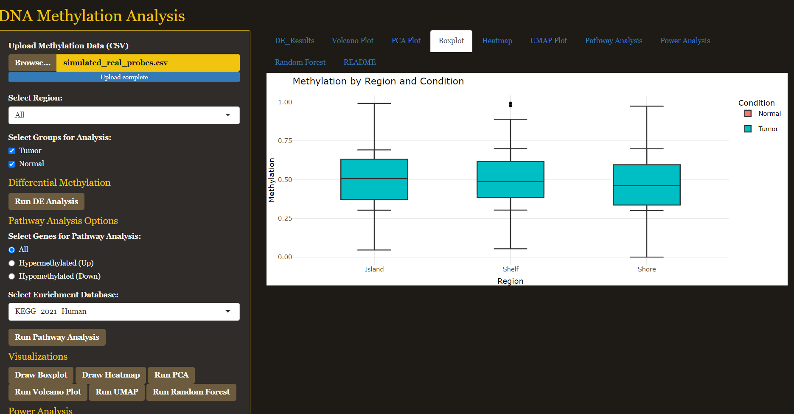

# DNA Methylation Shiny App

> An interactive R Shiny application for DNA methylation analysis with full support for HPC deployment via Singularity/Apptainer.

---

## 📑 Table of Contents
1. [Overview](#overview)  
2. [Features](#features)  
3. [Tech Stack](#️tech-stack)  
4. [Screenshots](#screenshots)  
5. [Repository Structure](#repository-structure)  
6. [Sample Data](#sample-data)  
7. [HPC Deployment with Singularity/Apptainer](#hpc-deployment-with-singularityapptainer)  
8. [Usage Summary](#usage-summary)  
9. [License](#license)

---

## 🧬 Overview

This Shiny app allows researchers to interactively explore DNA methylation data (e.g., Illumina 450k arrays). It supports differential methylation analysis, pathway enrichment, power analysis, unsupervised visualizations, and supervised machine learning using Random Forests.

---

## ⚙️ Features

### 📂 File Input & Filtering
- Upload `.csv` files containing methylation beta values.
- Filter by genomic region: **Island**, **Shore**, **Shelf**, or **All**.
- Dynamic UI for selecting groups (e.g., Tumor vs Normal).

### 🧪 Differential Methylation (DE)
- Paired t-tests on probe-level data.
- Outputs logFC, p-values, and FDR-adjusted values.
- Downloadable results in `.csv`.

### 🔬 Pathway Enrichment
- Probe → Gene mapping via `IlluminaHumanMethylation450kanno.ilmn12.hg19`.
- Uses **Enrichr API** to query:
  - KEGG_2021_Human
  - Reactome_2022
  - GO_Biological_Process_2023
- Interactive table + bar plot
- Download results

### 📊 Visualizations
- **Boxplot** by region and condition
- **Heatmap** with clustering
- **PCA** plot (2D, samples)
- **UMAP** plot (nonlinear projection)
- **Volcano Plot** (logFC vs -log10 p-value)
- All plots are interactive (Plotly)

### 🧠 Random Forest Classifier
- Trains RF on significant probes
- Outputs:
  - Prediction table
  - Accuracy, sensitivity, specificity, AUC
  - Feature importance
- All RF results downloadable

### 🔋 Power Analysis
- Calculates power from Cohen’s d, α, and desired power.
- Outputs:
  - Required sample size per group
  - Interactive power curve
- Downloadable summary table

### 📄 README Tab
- Renders internal `README.txt` file

---

## 🛠️ Tech Stack

**Languages & Frameworks:**
- [R](https://www.r-project.org/) (v4.5.0)
- [Shiny](https://shiny.posit.co/)
- [ggplot2](https://ggplot2.tidyverse.org/)
- [Plotly](https://plotly.com/r/)
- [caret](https://topepo.github.io/caret/)
- [randomForest](https://cran.r-project.org/web/packages/randomForest/)
- [pROC](https://cran.r-project.org/web/packages/pROC/)
- [pwr](https://cran.r-project.org/web/packages/pwr/)
- [uwot](https://cran.r-project.org/web/packages/uwot/)
- [enrichR](https://cran.r-project.org/web/packages/enrichR/)
- [Bioconductor](https://bioconductor.org/) (for annotation)

**Containerization:**
- [Singularity / Apptainer](https://apptainer.org/) for HPC deployment  
  (via `rocker/r-ver` base image)

**Visualization:**
- Interactive UI via `shiny`, `plotly`
- Heatmaps via `pheatmap` or Plotly heatmaps
- Dimensionality reduction via PCA + UMAP

**Machine Learning:**
- Random Forest classifier
- Model evaluation via confusion matrix + ROC AUC

---

## 🖼️ Screenshots

**DE Table View:**

**Box Plot View:**

---

## 📁 Repository Structure
methylation_shiny/
├── app.R # Main Shiny app
├── README.txt # App description
├── sample_data.csv # Example input
├── Singularity.def # HPC build file
└── screenshots/
├── DE_table.png
└── box_plot.png

---

## 🧪 Sample Data

The repo includes `sample_data.csv`, a test dataset for evaluating the full workflow.  
Expected format:

| Gene   | Region | Tumor1 | Tumor2 | Normal1 | Normal2 |
|--------|--------|--------|--------|---------|---------|
| CpG_1  | Island | 0.85   | 0.80   | 0.45    | 0.50    |
| CpG_2  | Shelf  | 0.30   | 0.35   | 0.60    | 0.55    |
| ...    | ...    | ...    | ...    | ...     | ...     |

---

## 🧬 HPC Deployment with Singularity/Apptainer

### 🔧 Build the image

**With root:**
in bash
sudo singularity build methylation_app.sif Singularity.def

Without root (fakeroot support):

in bash

singularity build --fakeroot methylation_app.sif Singularity.def

=
🚀 Run the app
in bash

singularity run methylation_app.sif

Output:

Launching DNA Methylation Shiny App...
Listening on http://0.0.0.0:3838

Open the app at:

http://localhost:3838

If on WSL2 or an HPC cluster, use SSH port forwarding:

ssh -L 3838:localhost:3838 user@hpc.cluster.edu

 Run via SLURM (HPC-compatible)
For automated deployment on SLURM clusters, use the provided submit_slurm.sh:
in bash
sbatch submit_slurm.sh

This script:

Requests resources (CPU, RAM, runtime)

Executes the container using Rscript /app/start.R

Starts the Shiny app inside the container

Ensure your cluster allows binding to port 3838.
Use SSH port forwarding from your local machine to access the app:

ssh -L 3838:localhost:3838 user@hpc.cluster.edu

Then open:

http://localhost:3838

📦 Files bundled in the container:
app.R

README.txt

sample_data.csv

(optionally) www/ folder for static assets

🧪 Usage Summary
Upload .csv file

Choose regions and sample groups

Run DE analysis

Run enrichment pathway analysis

Generate plots (PCA, UMAP, Volcano, Heatmap, etc.)

Train & evaluate Random Forest classifier

Run power analysis

Download all results
📄 License
MIT License © jcaperella29

